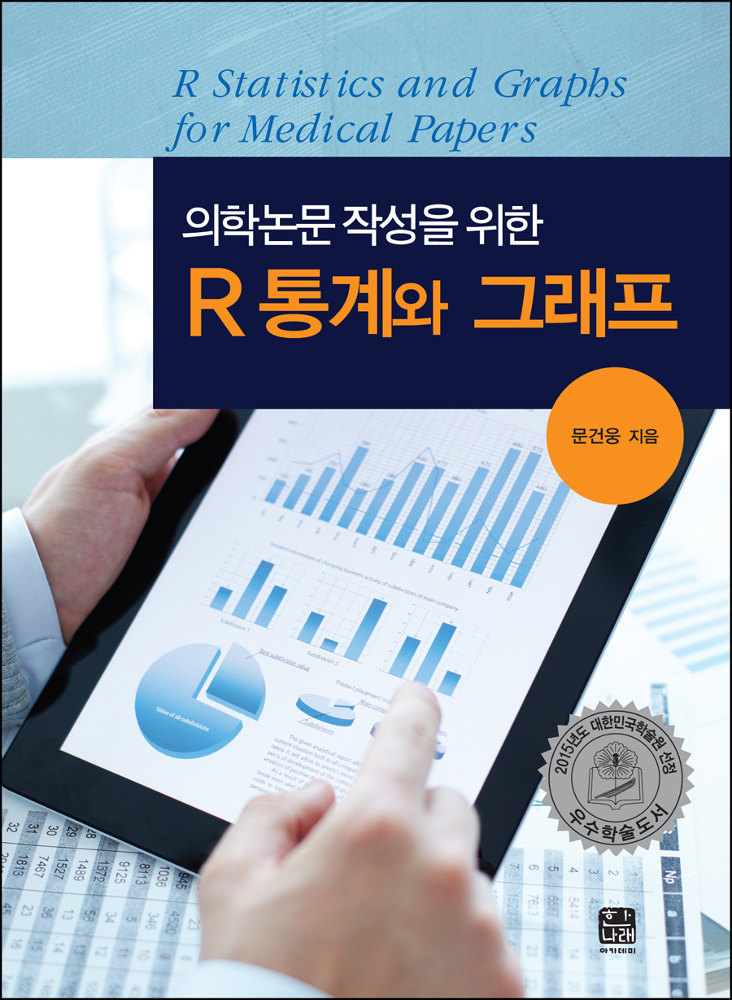
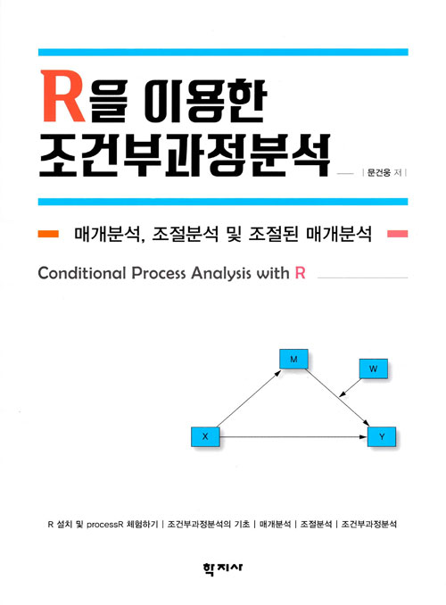
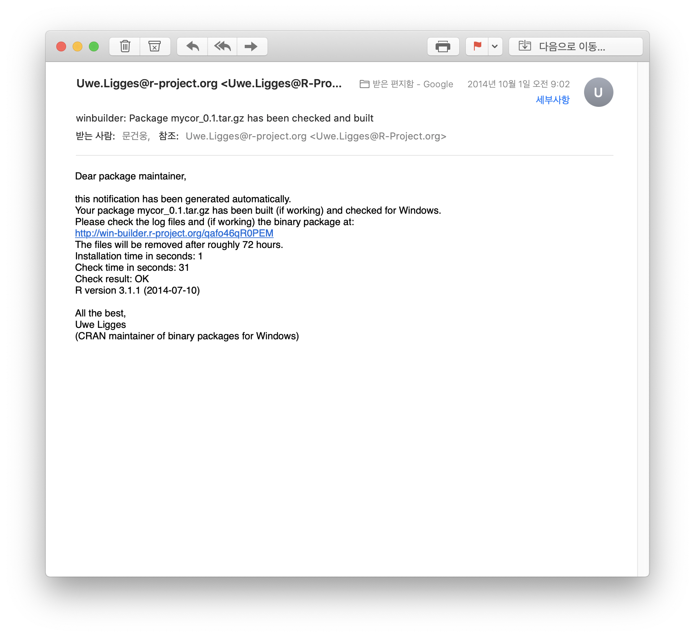
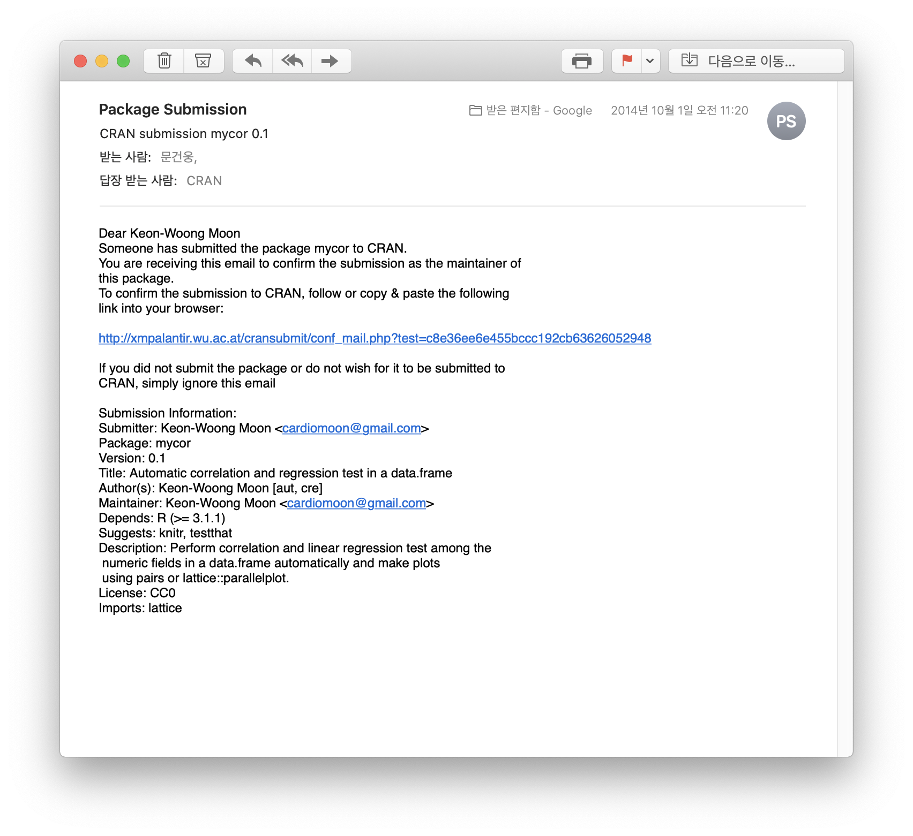
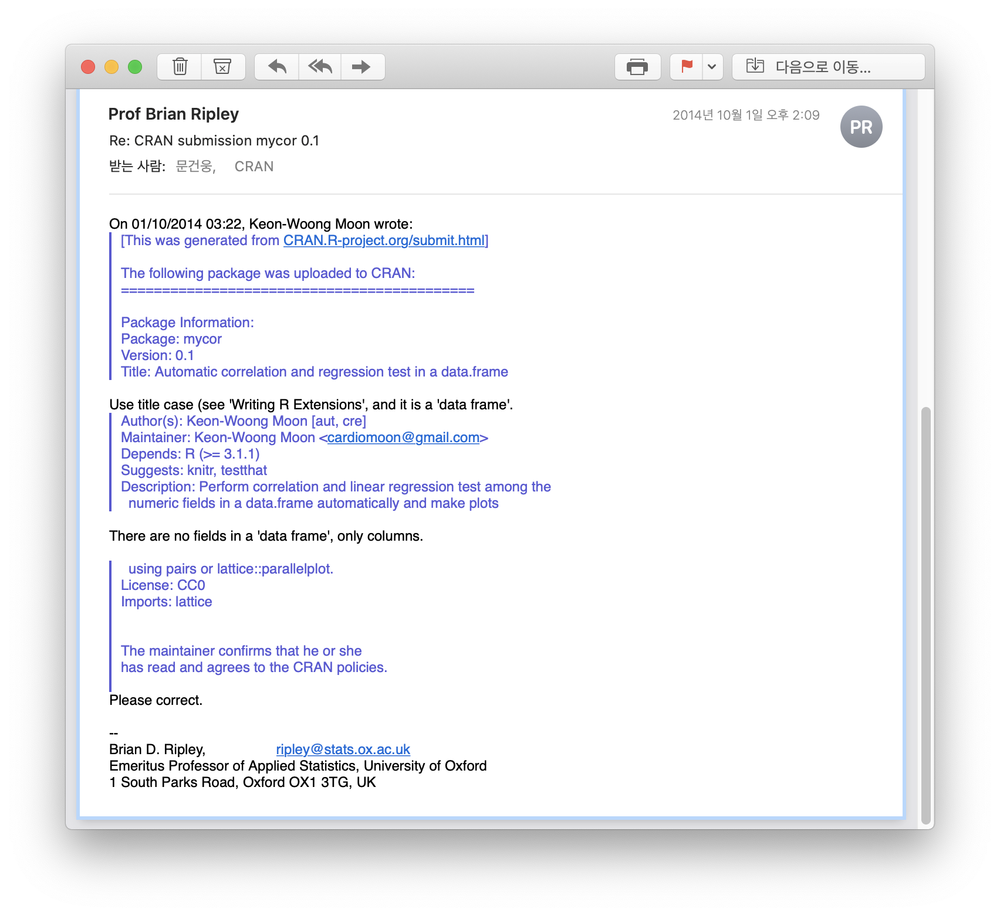
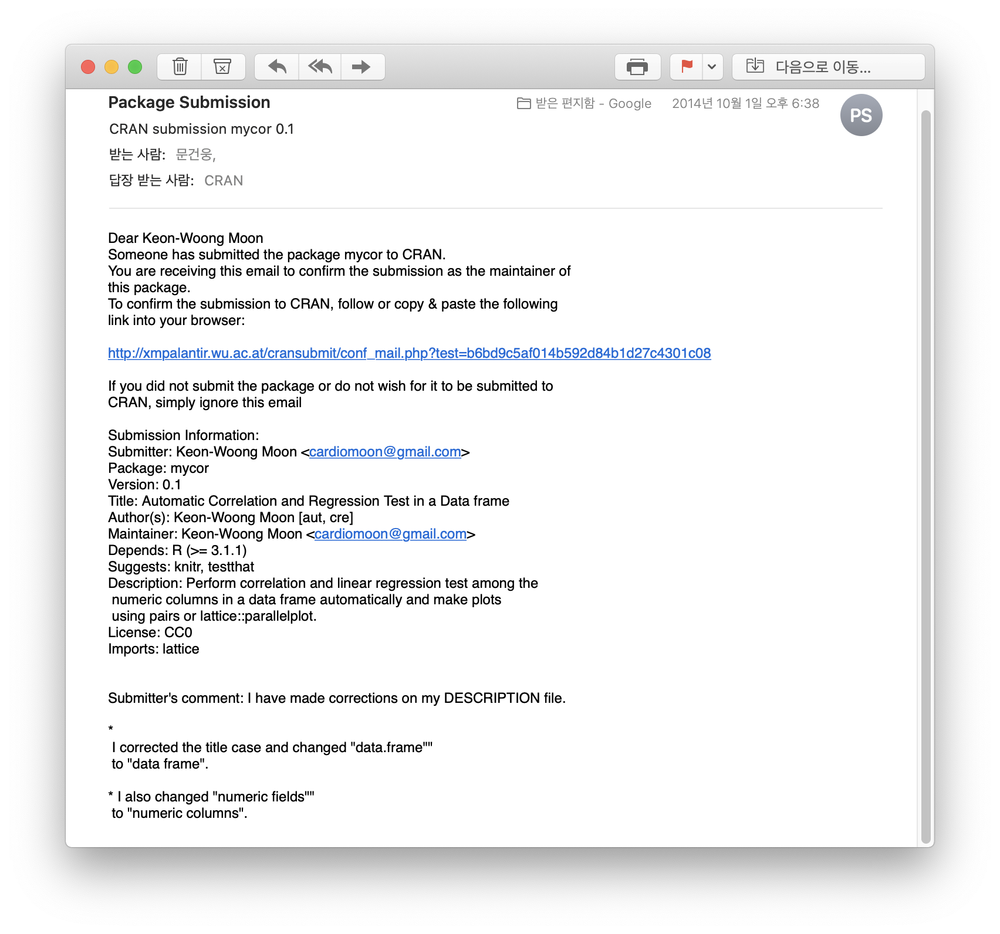
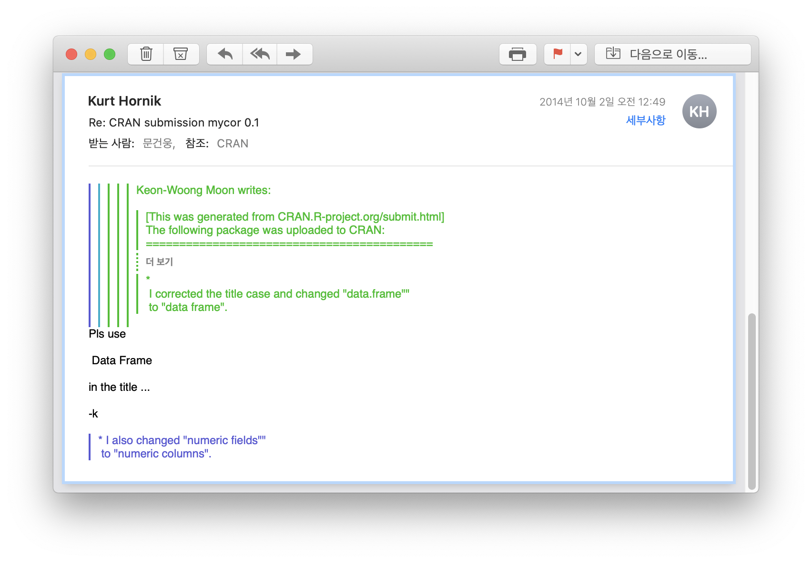
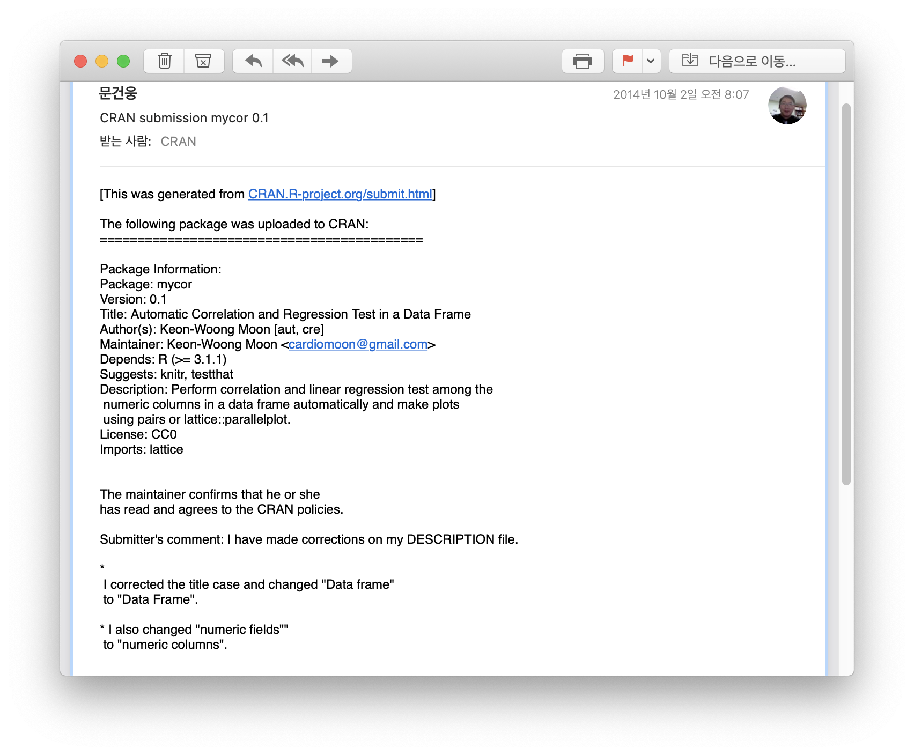
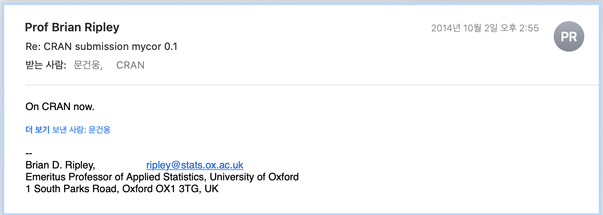

```{r setup, include=FALSE}
options(htmltools.dir.version = FALSE)
knitr::opts_chunk$set(echo = TRUE,message=FALSE,comment=NA,dpi=200)
```

```{r xaringan-themer, include=FALSE, warning=FALSE}
library(xaringanthemer)
style_duo_accent(
  primary_color = "#1381B0",
  secondary_color = "#FF961C",
  inverse_header_color = "#FFFFFF"
)
```

## 소개

문건웅

- 가톨릭대학교 의과대학 교수
- 성빈센트병원 순환기내과 재직

- 11 CRAN packages (CRAN)
  - mycor, moonBook, ztable(2015)
  - ggiraphExtra(2016) 
  - dplyrAssist, editData, ggplotAssist(2017)
  - rrtable (2018)
  - predict3d, processR (2019)
  - webr(2020)

- Web-R.org 운영(2015-)  
---
- Books
  - 의학논문 작성을 위한 R통계와 그래프(2015, 한나래) 
      - 2015년 대한민국 학술원 우수학술도서
  - 웹에서 클릭만으로 하는 R 통계분석(2015, 한나래) 
  - Learn ggplot2 Using Shiny App(2017, Springer)
  - R을 이용한 조건부과정분석(2019,학지사)

```{r,echo=FALSE,out.width="25%",fig.show="hold",fig.align="default",message=FALSE}
require(knitr)




```

---
class: inverse, center, middle

# The First CRAN package - mycor(2014)

---

# 개발동기

상관관계분석

```{r}
cor(mtcars[1:5])
```
```{r,error=TRUE}
cor(iris)
```
---
# 회귀분석
.pull-left[
```{r}
fit=lm(mpg~wt,data=mtcars)
fit
```
]

.pull-right[
```{r,echo=FALSE,message=FALSE}
require(predict3d)
ggPredict(fit,se = TRUE)
```
]


---

```{r}
require(mycor)
result=mycor(iris)
result
```
---
```{r,fig.width=6,fig.asp=1,out.width="70%",fig.align="center"}
plot(result)
```
---
```{r,fig.width=6,fig.asp=1,out.width="70%",fig.align="center"}
plot(result,groups=species,main="Test of mycor::plot")
```
---
```{r,fig.width=6,fig.asp=1,out.width="70%",fig.align="center"}
plot(result,type=4)
```

---
### Pre-release check

```{r,eval=FALSE}
devtools::check_win()
```


---
### CRAN submission



---

---

---

---

---
### On CRAN now



---