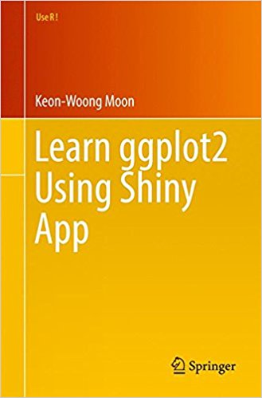
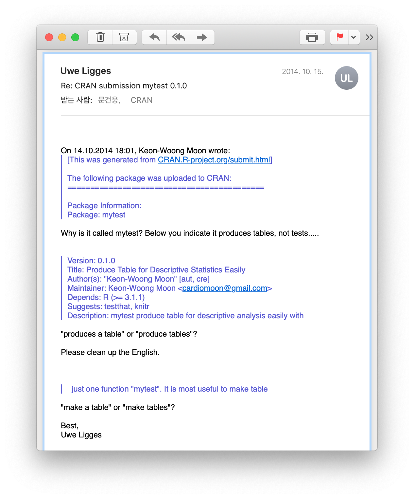
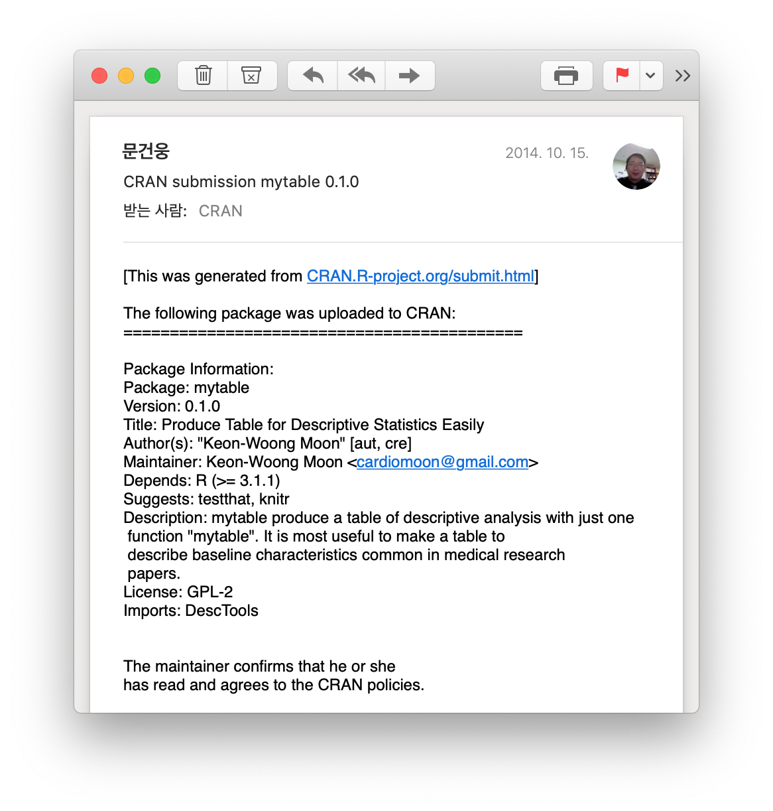
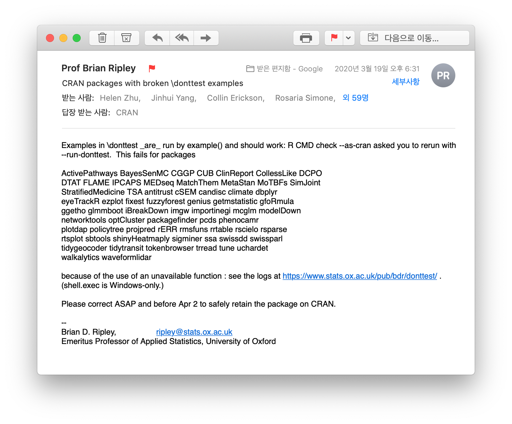

```{r setup, include=FALSE}
options(htmltools.dir.version = FALSE)
knitr::opts_chunk$set(echo = TRUE,message=FALSE,comment=NA,dpi=200)
```

```{r xaringan-themer, include=FALSE, warning=FALSE}
library(xaringanthemer)
style_duo_accent(
  primary_color = "#1381B0",
  secondary_color = "#FF961C",
  inverse_header_color = "#FFFFFF"
)
```

## 소개

문건웅

- 가톨릭대학교 의과대학 교수
- 성빈센트병원 순환기내과 재직

- 11 CRAN packages (CRAN)
  - mycor, moonBook, ztable(2014)
  - ggiraphExtra(2016) 
  - dplyrAssist, editData, ggplotAssist(2017)
  - rrtable (2018)
  - predict3d, processR (2019)
  - webr(2020)

- Web-R.org 운영(2015-)  
---
- Books
  - 의학논문 작성을 위한 R통계와 그래프(2015, 한나래) 
      - 2015년 대한민국 학술원 우수학술도서
  - 웹에서 클릭만으로 하는 R 통계분석(2015, 한나래) 
  - Learn ggplot2 Using Shiny App(2017, Springer)
  - R을 이용한 조건부과정분석(2019,학지사)

```{r,echo=FALSE,out.width="25%",fig.show="hold",fig.align="default",message=FALSE}
require(knitr)

include_graphics("figures/book2.jpg")


```
---
class: inverse, center, middle

# 논문 출판과 CRAN 등록
---

---
[](https://cran.r-project.org/web/packages/moonBook/index.html)

---
## R 패키지를 만드는 이유는?


- An R package is a good method for distributing functions to users.

- R Packages require documentation and the package structure allows you to distribute functions and documentation together.

---

### Which of the following files and folders are required in an R package?

- An inst/ directory.


- A NAMESPACE file.


- A DESCRIPTION file.


- The R/ directory.


- The man/ directory.


- A README.md file.

---
### 참고문헌 : R package

- Manual : [Writing R Extensions](https://cran.r-project.org/doc/manuals/r-release/R-exts.html)

- [R packages](https://r-pkgs.org/)

- [Mastering Software Development in R](https://bookdown.org/rdpeng/RProgDA/)

- [Coursera - Building R packages](https://www.coursera.org/learn/r-packages/home/welcome)
---
class: inverse, center, middle

# The First CRAN package - mycor(2014)

---

# 개발동기

상관관계분석

```{r}
cor(mtcars[1:5])
```
```{r,error=TRUE}
cor(iris)
```
---
# 회귀분석
.pull-left[
```{r}
fit=lm(mpg~wt,data=mtcars)
fit
```
]

.pull-right[
```{r,echo=FALSE,message=FALSE}
require(predict3d)
ggPredict(fit,se = TRUE)
```
]


---

```{r}
require(mycor)
result=mycor(iris)
result
```
---
```{r,fig.width=6,fig.asp=1,out.width="70%",fig.align="center"}
plot(result)
```
---
```{r,fig.width=6,fig.asp=1,out.width="70%",fig.align="center"}
plot(result,groups=species,main="Test of mycor::plot")
```
---
```{r,fig.width=6,fig.asp=1,out.width="70%",fig.align="center"}
plot(result,type=4)
```

---
### Pre-release check

```{r,eval=FALSE}
devtools::check_win()
```


---
### CRAN submission


---

---

---

---

---
### On CRAN now


---
class: inverse, center, middle

# The 2nd CRAN package - moonBook(2014)

---
[](https://cran.r-project.org/web/packages/moonBook/index.html)

---
### The First Trial - package "mytest"

```{r,out.width="70%",echo=FALSE}

```
---
```{r,out.width="70%",echo=FALSE}

```

---
### The 2nd Trial - package "mytable"
```{r,echo=FALSE}

```
---
```{r,echo=FALSE}

```

---
.pull-left[
```{r,echo=FALSE}

```
]
.pull-right[
```{r,echo=FALSE}

```
]
---
```{r,echo=FALSE}

```
---
```{r,echo=FALSE}

```
---
```{r,echo=FALSE}

```
---
### The 3nd Trial - package "moonBook"

```{r,echo=FALSE,out.width="70%"}

```
---
```{r,echo=FALSE}

```
---
```{r,echo=FALSE}

```
---
```{r,echo=FALSE}

```
---
```{r,echo=FALSE}

```
---
```{r,echo=FALSE}

```

---
class: inverse, center, middle

# Maintenance of CRAN packages

---
### CRAN 패키지를 업데이트 해야 하는 경우

- Bug fix

- 새로운 함수, 데이터 추가

- dependent package가 업데이트 되는 경우

- CRAN 정책이 바뀐 경우

- R버전의 엡데이트에 따른 호환성을 유지하기 위해
---
```{r,echo=FALSE}

```
---
```{r,echo=FALSE}

```
---
```{r,echo=FALSE}

```
---
```{r,echo=FALSE}

```
---
```{r,echo=FALSE}

```


